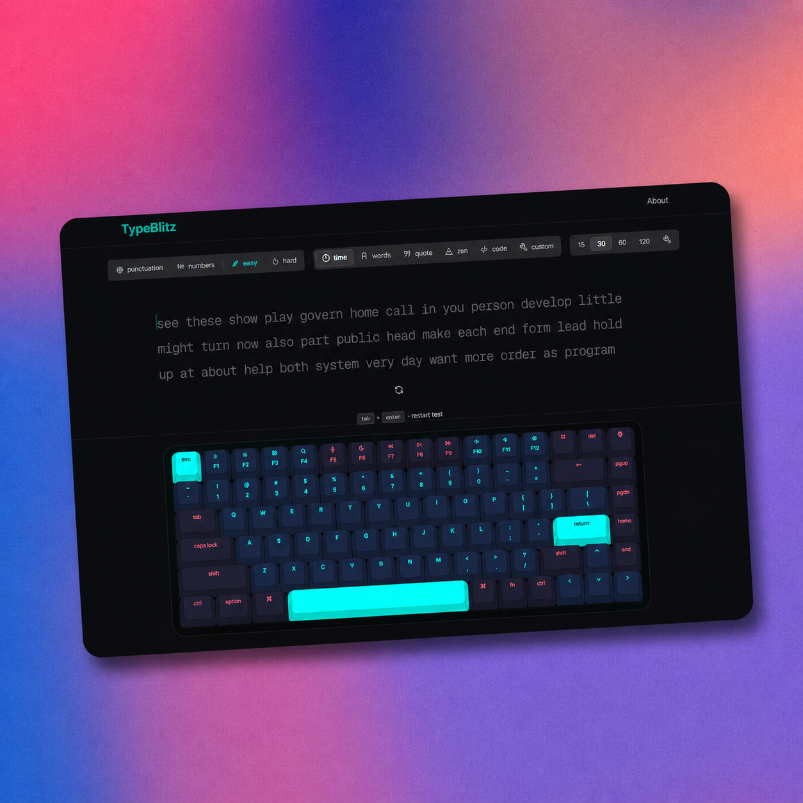

#  TypeBlitz

> A fast and modern typing test platform inspired by Monkeytype.

---

## 🌐 Live Demo
- https://typeblitz-flax.vercel.app/

---

## 📸 Preview


---

## ✨ Features
- Real-time typing speed & accuracy
- Clean and minimal UI
- Dark / Light mode
- Responsive design
- Code typing mode
- Analytics (WPM, accuracy)

---

## 🛠️ Tech Stack

### Frontend
- Next.js 16
- React 19
- TypeScript

### Styling
- Tailwind CSS
- Shadcn UI

### Libraries
- Monaco Editor
- Recharts
- Framer Motion
- Canvas Confetti

---

## 📦 Installation

```bash
git clone https://github.com/soumyaranjan-p/typeblitz
cd typeblitz
npm install
npm run dev